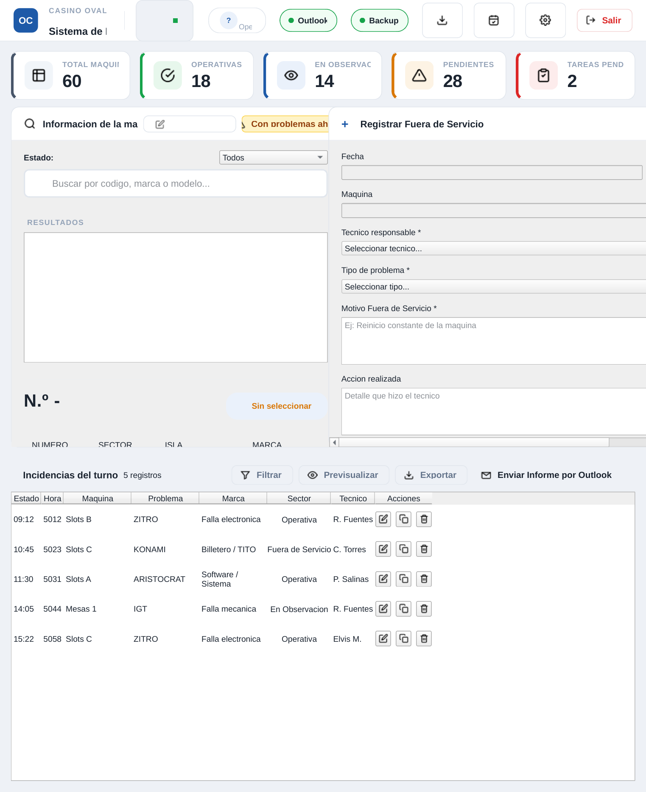
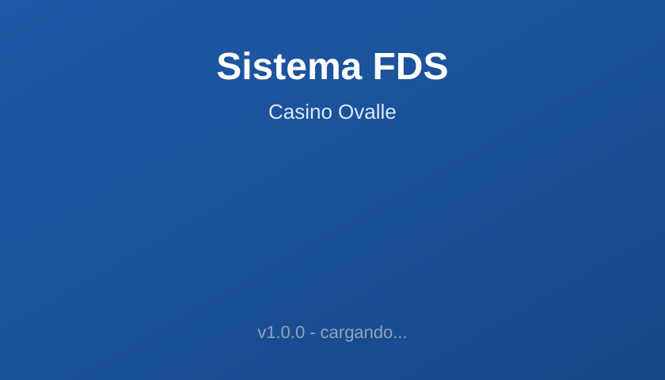
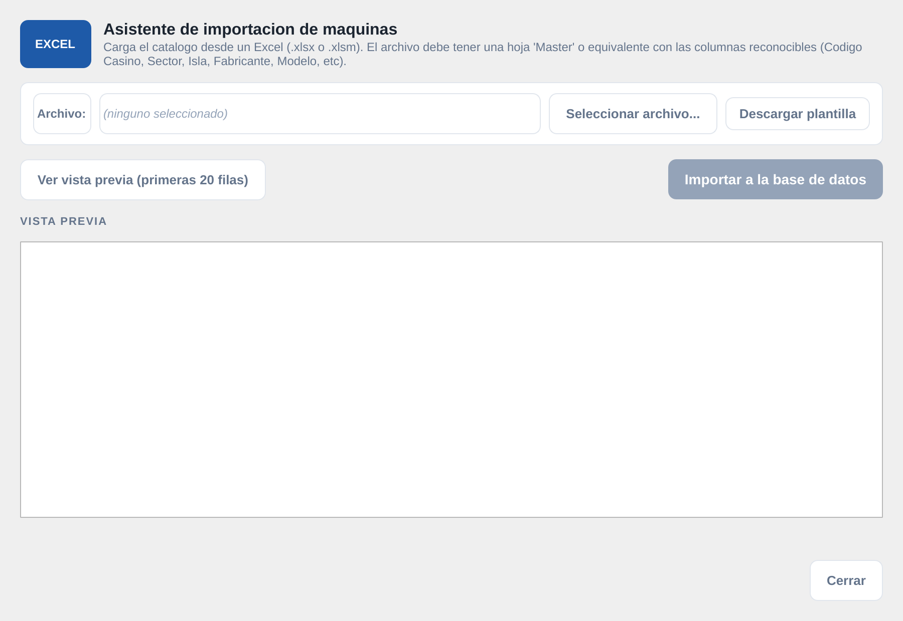
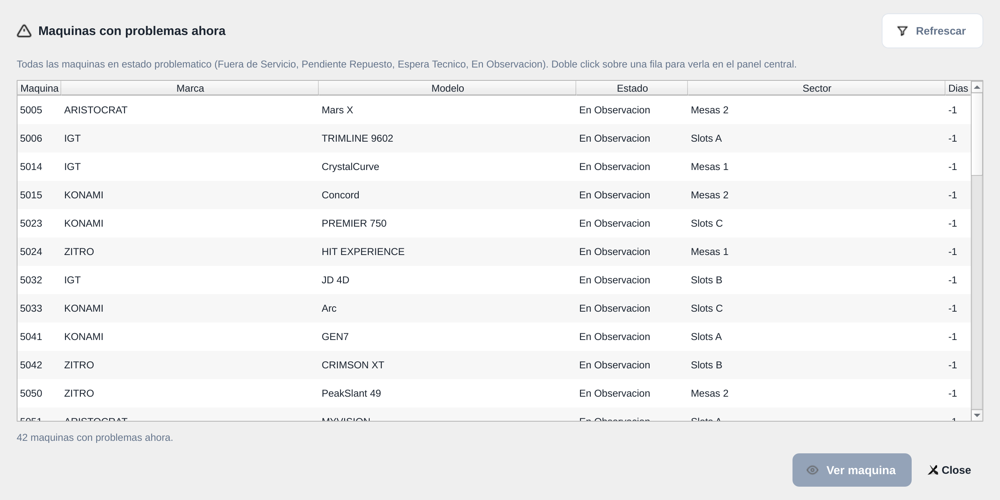
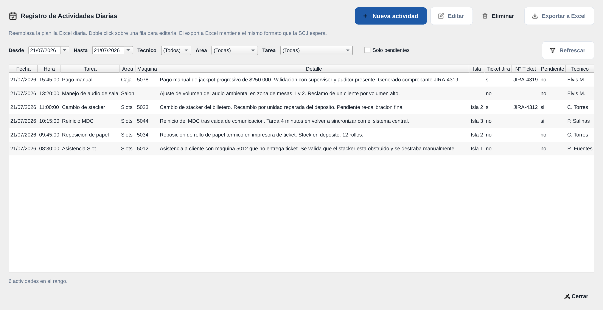
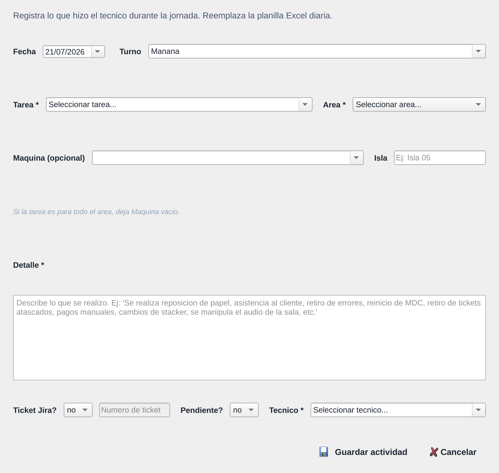
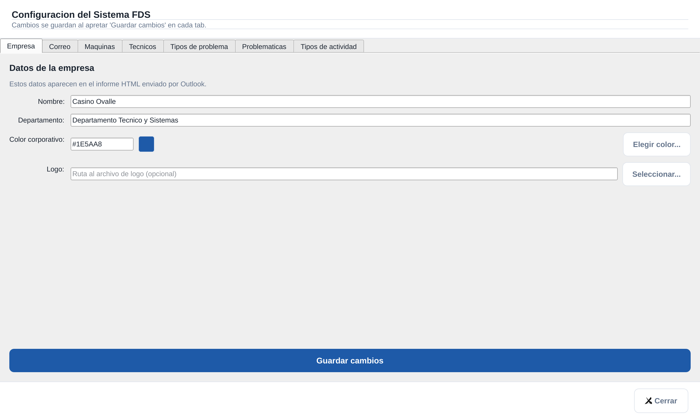
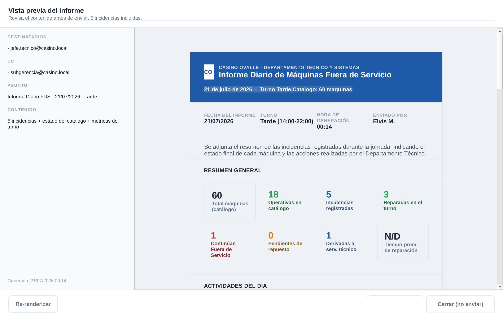
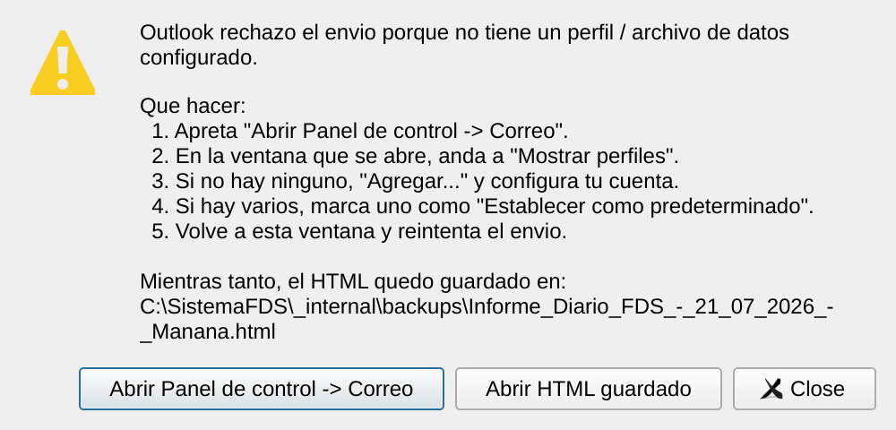

# Sistema de Registro de Maquinas Fuera de Servicio (FDS)

Aplicacion desktop para el Casino Ovalle Resort que reemplaza la planilla Excel
diaria de cierre de turno del Departamento Tecnico y Sistemas. Registra maquinas
fuera de servicio, actividades diarias, y envia el informe por Outlook al cierre
de turno.

Pensado para correr en una VM Windows dentro del casino (Python 3.12 + PySide6 +
SQLite + Outlook COM). Tambien funciona en Linux/macOS para desarrollo.

---

## Capturas de pantalla

### Pantalla principal (turno en curso)



Topbar con marca, fecha actual, turno detectado, usuario, chips de Outlook/Backup,
y accesos a importacion, registro de actividades y configuracion. Debajo, 5 cards
KPI clickeables (Total, Operativas, En observacion, Pendientes, Tareas pendientes)
que filtran el panel central y disparan los dialogs. Form de "Registrar Fuera de
Servicio" a la derecha (60% del ancho) y tabla de incidencias del turno abajo.

### Splash al iniciar



Feedback inmediato mientras se cargan PySide6 + SQLAlchemy + openpyxl + jinja2 +
win32com (los `.exe` de PyInstaller tardan 2-3 segundos en mostrar la ventana
principal).

### Asistente de importacion de maquinas desde Excel



Flujo de 4 pasos: descargar plantilla, seleccionar archivo, vista previa de las
primeras 20 filas, ejecutar importacion con resumen (insertadas vs actualizadas).
Valida codigos de maquina, sectores, islas, marcas.

### Maquinas con problemas ahora



Listado en tiempo real de las maquinas en estado Fuera de Servicio / Pendiente
Repuesto / Espera Servicio Tecnico / En Observacion. Sin filtro de tiempo -
muestra el estado actual del parque.

### Registro de Actividades Diarias



Reemplaza la planilla Excel diaria. 11 columnas (Fecha, Hora, Tarea, Area,
Maquina, Detalle, Isla, Ticket Jira, N° Ticket, Pendiente, Tecnico) mas filtros
por rango de fechas, tecnico, area, tarea, y checkbox "Solo pendientes". Doble
click edita, exporta a Excel con el mismo formato que espera la SCJ para
auditoria.

### Alta de actividad



Form completo con Fecha, Turno, Tarea (catalogo configurable), Area, Maquina
(autocompletar del catalogo), Detalle libre, Isla, N° Ticket Jira (se habilita
solo si el checkbox esta activo), Tecnico, y badge de "Pendiente".

### Configuracion (7 tabs)



Tabs: **Empresa** (nombre, departamento, color corporativo, logo) - **Correo**
(destinatarios TO/CC, asunto template, modo Display/Send) - **Maquinas**
(catalogo con tabs Activas/Inactivas, alta/baja logica, editor por fila) -
**Tecnicos** (catalogo editable) - **Tipos de problema** y **Tipos de
actividad** (catalogos soft-delete con migracion inicial desde `config.py`).

### Preview del informe HTML antes de enviar



Asunto, destinatarios, CC y cuerpo HTML renderizado con resumen general,
actividades del dia, tabla de incidencias, pendientes para el proximo turno y
firma. El operador revisa y recien ahi acepta enviar.

### Dialog accionable cuando Outlook no tiene perfil



Si Outlook rechaza el envio con "no se encuentra un archivo de datos"
(perfil / cuenta default no configurados), el sistema muestra un dialog
con pasos concretos: boton "Abrir Panel de control -> Correo" que dispara
`control.exe` (Win10/11) y lleva al operador directo a la pantalla de
perfiles, mas la ruta del HTML persistido por si quiere enviarlo manual
mientras tanto.

---

## Funcionalidades

### Registro de Maquinas Fuera de Servicio (FDS)
- Catalogo de maquinas con codigo casino, codigo SCJ, sector, isla, marca
  (ARISTOCRAT, IGT, KONAMI, ZITRO), modelo, serie, denominacion del juego.
- Importacion masiva desde Excel con vista previa y resumen.
- Alta, edicion, duplicado y baja de maquinas.
- Cambio de estado: Operativa / Fuera de Servicio / Pendiente Repuesto /
  Espera Servicio Tecnico / En Observacion.
- Buscador live con autocompletar, filtro de estado persistente entre sesiones
  (QSettings), historial de busquedas.

### Registro de Incidencias del turno
- Form con maquina, tecnico, problema, motivo fuera de servicio, accion
  realizada, estado final, observaciones.
- Autosave de borradores cada 2 segundos (si la app crashea, no se pierde).
- Tabla inferior con 8 columnas: Estado, Hora, Maquina, Problema, Marca, Sector,
  Tecnico, Acciones (editar, duplicar, eliminar).
- Filtros live por estado/tecnico/maquina con contador "N de M".
- Edicion actualiza en lugar de crear duplicado.
- Duplicar abre form pre-llenado (caso tipico: misma maquina se reincio 4 veces
  en el turno).

### Registro de Actividades Diarias (reemplaza planilla Excel)
- 11 columnas en el mismo orden que el Excel original del operador.
- Filtros por rango de fechas, tecnico, area, tarea.
- Marcar actividad como "pendiente" = queda abierta para el proximo turno.
- Vinculo opcional con ticket Jira.
- Export a `.xlsx` con el formato que la SCJ espera para auditoria.

### Dashboard KPI (5 cards clickeables)
- Total maquinas, Operativas, En Observacion, Pendientes (suma FDS + Pend Rep +
  Esp Tec), Tareas pendientes (actividades marcadas).
- Cada card dispara una accion: filtra el buscador, abre dialog de problematicas,
  o abre actividades con filtro "solo pendientes".

### Informe diario por Outlook
- HTML profesional con resumen, actividades del dia, incidencias del turno,
  pendientes para proximo turno, observaciones.
- Modo Display (default): muestra preview antes de enviar para que el operador
  revise. Modo Send: manda directo.
- Backup automatico pre-envio (snapshot de la DB).
- Indicador "Outlook OK" / "Sin Outlook" en el topbar.
- Chip de Backup con edad del ultimo (verde < 30 min, amarillo < 2 h, rojo > 2 h).

### Configuracion
- 7 tabs: Empresa, Correo, Maquinas, Tecnicos, Tipos de problema, Maquinas
  problematicas, Tipos de actividad.
- Catalogos (tipos de problema, tipos de actividad, tecnicos) soft-delete con
  migracion inicial desde `config.py`.
- Cambios persisten en SQLite.

### Atajos de teclado
- `Ctrl+E`: enviar informe por Outlook
- `Ctrl+N` o `Ctrl+I`: nueva incidencia (limpia form + foco en maquina)
- `Ctrl+F`: foco en el buscador
- `Ctrl+L`: refrescar lista de maquinas (limpia filtro)
- `Ctrl+A`: abrir dialog de Actividades Diarias
- `Ctrl+T`: abrir dialog de Maquinas con problemas
- `Esc`: cancelar edicion / limpiar form

### Operacion
- Splash screen al iniciar (feedback inmediato).
- Backup automatico cada 30 minutos en `/backups/` (rota, conserva 10).
- Logging estructurado en `/logs/sistema_fds.log` con rotacion.
- Tema corporativo Casino Ovalle (color `#1E5AA8`) via QSS.
- Version visible en splash, titulo de ventana y chip del topbar.

---

## Configuracion del envio de correo electronico

El sistema soporta **3 metodos de envio** del informe al cierre de turno.
Se eligen en **Settings → Correo → seccion SMTP** con el dropdown **"Proveedor"**:

### Gmail (la opcion mas facil, recomendada)

1. Crear una cuenta Gmail separada para el sistema (ej: `fds.casino.ovalle@gmail.com`).
2. Habilitar **verificacion en 2 pasos** en https://myaccount.google.com/security
3. Generar un **App Password** en https://myaccount.google.com/apppasswords
   (nombre: `Sistema FDS Casino Ovalle`)
4. En el FDS: elegir **"Gmail"** en el dropdown, completar Usuario (la
   casilla de Gmail) y Password (el App Password de 16 chars).
5. **"Probar conexion"** -> si dice OK, **"Guardar cambios"**.

Limitacion: el correo sale desde `fds.casino.ovalle@gmail.com`, no desde
`Satovalle.OV@ovallecasinoresort.cl`. Gmail permite hasta 500 emails
por dia por cuenta (sobra para 3 informes diarios).

### Microsoft 365 / Outlook (App Password)

Requiere que **el admin del tenant M365 habilite App Passwords**.
Si en tu cuenta no aparece la opcion "Contraseña de aplicacion" en
https://mysignins.microsoft.com/security-info, es probable que este
deshabilitado a nivel organizacion. En ese caso, hablar con el admin
o usar Gmail como alternativa.

1. Activa MFA en https://mysignins.microsoft.com/security-info (metodo
   preferido: Microsoft Authenticator).
2. Crea un App Password.
3. En el FDS: elegir **"M365 (App Password)"** en el dropdown,
   completar Usuario (la direccion M365 real) y Password (el
   App Password).
4. **"Probar conexion"** -> OK -> **"Guardar cambios"**.

### Microsoft 365 (OAuth2 / XOAUTH2)

Para tenants con App Passwords deshabilitado. Requiere:
- App Registration en Azure con permisos `Mail.Send`
- (No implementado todavia en esta version - el placeholder esta en
  el dropdown pero redirige al camino del App Password o Gmail.)

### Como fallback automatico

Si no se configura SMTP, el sistema intenta enviar via Outlook clasico
(via `win32com` + COM Automation). Esto **no funciona con el "Nuevo
Outlook"** de Microsoft 365 / Windows 11 — la unica salida es el HTML
persistido en `backups/` que el operador puede abrir a mano y mandar
manualmente.

Si ves el dialog "Outlook no disponible (win32com no encontrado)"
cuando apretas "Enviar Informe por Outlook", significa que:
- No tenes Outlook clasico instalado en la VM, **o**
- Tu organizacion forzo la transicion a "Nuevo Outlook".

La fix limpia para el operador es configurar SMTP (con Gmail es la
mas rapida — toma 5 minutos).

---

## Stack tecnico

- **Python 3.12+**
- **PySide6 6.11** (Qt6) - UI desktop
- **SQLAlchemy 2.0** ORM - SQLite local
- **openpyxl 3.1** - import/export Excel
- **Jinja2 3.1** - render del informe HTML
- **pywin32** (solo Windows) - integracion con Outlook COM
- **PyInstaller** (solo Windows) - empaquetado `.exe`

## Instalacion y uso

```bash
# Clonar
git clone https://github.com/ev4squez/Cierre_Turno.git
cd Cierre_Turno

# Crear venv y deps
python -m venv .venv
.venv/bin/pip install -r requirements.txt

# Correr
.venv/bin/python app.py

# En Windows (donde corre el operador)
git pull
python .\app.py
```

## Empaquetado para Windows

```bash
.venv/bin/pyinstaller app.spec
# Genera dist/SistemaFDS.exe listo para distribuir en la VM del casino
```

## Estructura del proyecto

```
app.py                      Entry point + splash + version
config.py                   Constantes, paths, defaults (turnos, catalogos)
database/
  db.py                     Engine + session factory + init_db
  models/                   SQLAlchemy 2.x: Maquina, Incidencia,
                            ActividadDiaria, Tecnico, TipoProblema,
                            TipoActividad, Borrador, Auditoria
services/
  maquinas.py               CRUD catalogo + importar Excel
  incidencias.py            CRUD + resumen del turno
  actividades_db.py         CRUD + listado por rango / turno
  email_renderer.py         render_informe() -> HTML Jinja2
  outlook.py                win32com: enviar / display del correo
  backup.py                 backup automatico + rotacion
  auditoria.py              log de operaciones sensibles
ui/
  main_window.py            MainWindow (widgets tontos, emiten signals)
  topbar.py                 Logo + fecha + turno + usuario + chips
  dashboard_bar.py          5 KPI cards clickeables
  machine_panel.py          Buscador embebido + info maquina
  form_panel.py             Form FDS con autosave
  bottom_table.py           Tabla de incidencias + filtros
  search_panel.py           Buscador live con historial
  actividades_dialog.py     Modal de registro de actividades
  maquinas_problematicas_dialog.py
  preview_dialog.py         Preview HTML antes de enviar
  settings_dialog.py        7 tabs de configuracion
controllers/
  main_controller.py        Orquesta todo: signals -> services -> UI
templates/
  informe_fds_email.html    Template Jinja2 del informe
docs/
  screenshots/              Capturas del README
tests/                      Smoke tests
```

## Auditoria y SCJ

- Tabla `auditoria` registra quien hizo que operacion y cuando (alta, edicion,
  eliminacion, importacion, envio de informe).
- Cada incidencia guarda: fecha, hora, turno, usuario del sistema, tecnico que
  registro.
- Export Excel de actividades diarias respeta el formato que pide la
  Superintendencia de Casinos de Juego.
- Backup automatico cada 30 minutos para no perder registros ante un crash del
  sistema o corte de luz en la sala.

## Licencia

Uso interno - Casino Ovalle Resort.